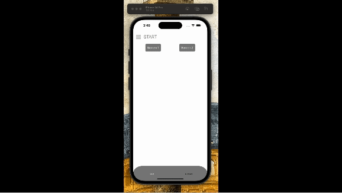

# Gerald Technical Challenge

This is my finalized Animated Drawer project using React Native with Typescript.

Dev: Germán Gómez 🇦🇷




## How to run

### 1. Download or Clone this repository

Open terminal
```
git clone https://github.com/gg-ballin/GeraldChallenge.git
git checkout develop
```
### 2. Install dependencies
Once you've already cloned the project, run:
``` npm i ``` or ```yarn```


#### iOS Specific
Install pods

```
  cd ios && pod install
```
#### Additional required steps

Is required for this project tu use node version 16 to run:
```
nvm use 16
```
After that, you can start the metro bundler with:

```
yarn start
```

### 3. Run the project
#### iOS
```
react-native run-ios
```

#### Android
```
react-native run-android
```

### External libraries used

- [react-navigation](https://github.com/react-navigation/react-navigation) (Bottom Tab, Stack and Drawer navigators where used using this library)
- [react-native-reanimated](https://github.com/software-mansion/react-native-reanimated/) 
